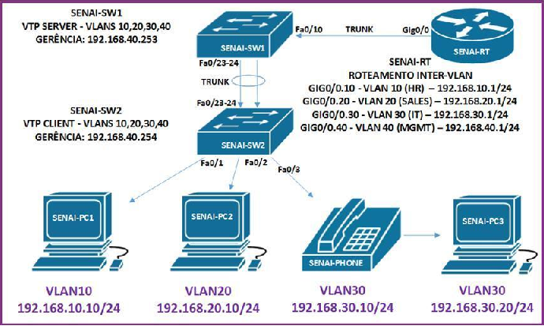

# Redes_Network

## Olá, aqui compartilho um pouco do meu conhecimento em redes, usando packect tracer. Alguns conhecimentos sobre redes empresariais. Conhecimento baseado em Roteadores e Switches CISCO

- [NetAcad](https://www.netacad.com/pt-br) : Link para realizar estudo na plataforma Cisco.

# Troubleshooting de Ambiente Simulado.

Modelo de Troubleshooting é baseado no modelo ISO/OSI 7 Camadas Neste modelo usamos até a camada 3

- [Modelo OSI](https://pt.wikipedia.org/wiki/Modelo_OSI) : Link com informações sobre o modelo OSI e suas camadas.

# **PROBLEMA:** rede SENAI não funciona.

## **OBJETIVO:** restabelecer o mais prontamente possivel a infraestrutura do cliente.

# Primeiro passo é analisar a sua topologia, o que voçê tem de informação sobre a rede defeituosa. 

## Abaixo algumas anotações sobre a topologia disponível

### PREMISSA - TÉCNICAS ###

	-Rede: 192.168.10.1/24 > VLAN 10(RH) | G0/0.10
	-Rede: 192.168.20.1/24 > VLAN 20(VENDAS) | G0/0.20
	-Rede: 192.168.30.1/24 > VLAN 30(TI) | G0/0.30
	-Rede: 192.168.40.1/24 > VLAN 40(GERÊNCIA) | G0/0.40
	-VTP SERVER - VLANS 10,20,30,40 | SENAI-SW1
	-VTP CLIENT - VLANS 10,20,30,40 | SENAI-SW2

    

# Após algumas anotações sobre a rede, partimos para a resolução dos problemas. No modelo OSI, temos um método em que começamos de baixo para cima, ou seja, Camada 1 - Física. Na camada física o principal problema encontrado é sempre relacionado a hardware, algo físico, seja cabos de par trançado, fibra óptica e muito mais. 

- [Camada Física](https://pt.wikipedia.org/wiki/Camada_f%C3%ADsica) : Link com informações sobre a camada física do modelo OSI

